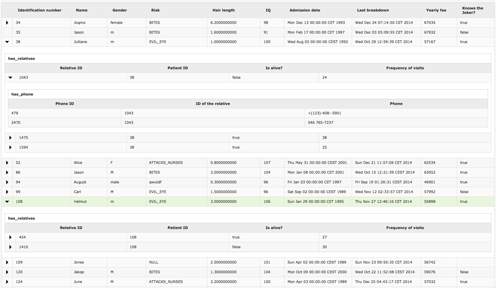

# React test task

The only requirement that we have is to use React, all other choices like state management library, CSS preprocessor, build tools etc. are up to you. You can of course use a boilerplate if you want to.

## The task looks like this:

Please create an application which creates a hierarchy table from input data in .json format.

Every item in json consists of it’s own data and array, which items represents child data. Item’s data can have a variable number of attributes (key: value) and item can have a variable number of nested child items. When you click on item, direct child items are hidden/shown.

In the attachment you can see an example of data in [json](data-1.json) and [screenshot](screenshot.png) of the hierarchy table.

Use the attached data.json and create the hierarchy table application (similar to screenshot). The application has data and present layer, which are clearly separated. Add a functionality delete item, which deletes item in data and present layer in your application. If item has children items, they are deleted as well.

## Evaluation criteria
What is important
- code quality
- correct usage of chosen technologies
- data consistency

What is less important
- web page design

## Screenshot
